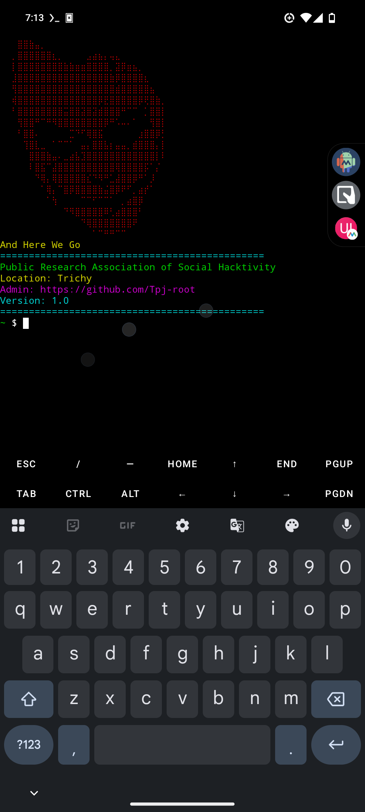

# ========================================================
# Termux Basic Commands Reference
# ========================================================


## Screenshot




# -----------------------------
# 1. Update & Upgrade Packages
# -----------------------------
# Update the package lists for upgrades and new packages
pkg update

# Upgrade all installed packages to the latest version
pkg upgrade

# -----------------------------
# 2. Install Basic Tools
# -----------------------------
# Git: version control
# curl/wget: download files from web
# nano/vim: text editors
# python: scripting language
# clang/make: build tools
pkg install git curl wget nano vim python clang make

# -----------------------------
# 3. File Operations
# -----------------------------
ls            # List files and directories
cd <dir>      # Change directory
pwd           # Show current working directory
cp a b        # Copy file 'a' to 'b'
mv a b        # Move or rename file
rm a          # Delete file 'a'
mkdir new     # Create a new directory
rmdir old     # Remove an empty directory

# -----------------------------
# 4. Package Management
# -----------------------------
pkg search <name>      # Search for a package
pkg install <name>     # Install a package
pkg uninstall <name>   # Remove a package
pkg list-installed     # List all installed packages

# -----------------------------
# 5. Git Usage
# -----------------------------
git clone <repo_url>   # Clone a repository
git pull               # Update repository with latest changes
git status             # Check repository status

# -----------------------------
# 6. Python Usage
# -----------------------------
python                 # Launch interactive Python shell
python script.py       # Run a Python script

# -----------------------------
# 7. System Information
# -----------------------------
uname -a               # Show system information
top                    # Show running processes
df -h                  # Show disk usage in human-readable format
whoami                 # Show current user

# -----------------------------
# 8. Exit Termux
# -----------------------------
exit                   # Close the Termux session

# -----------------------------
# 9. Environment Variables
# -----------------------------
env                     # Display all environment variables
printenv                # Same as env
printenv HOME           # Show value of HOME directory
echo $PATH              # Show PATH variable (directories for commands)

# -----------------------------
# 10. Permanent Alias
# -----------------------------
# Add a permanent alias to quickly edit bash.bashrc
alias edit='nano /data/data/com.termux/files/usr/etc/bash.bashrc'

# After adding, run:
# source /data/data/com.termux/files/usr/etc/bash.bashrc
# to apply changes immediately


Use these short commands in Termux to see installed packages.

Show packages (Termux `pkg`):

```bash
pkg list-installed
```

Show Debian-style list (more detailed):

```bash
dpkg -l
```

Show apt-style (names + versions):

```bash
apt list --installed
```

Show only package names (one-liner):

```bash
dpkg -l | awk '/^ii/ {print $2}'
```

Search within installed list (example: cmake):

```bash
pkg list-installed | grep -i cmake
# or
dpkg -l | grep -i cmake
```

Save list to a file:

```bash
pkg list-installed > ~/termux_installed.txt
```


